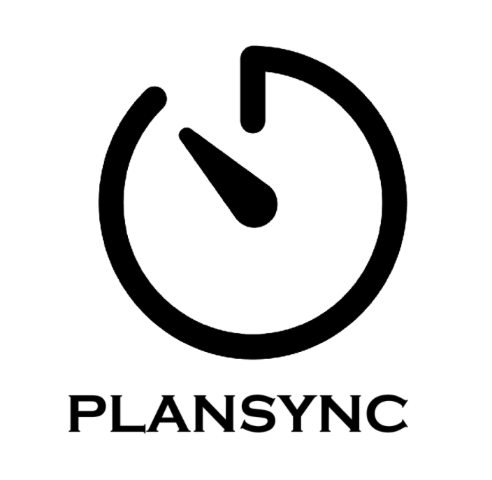
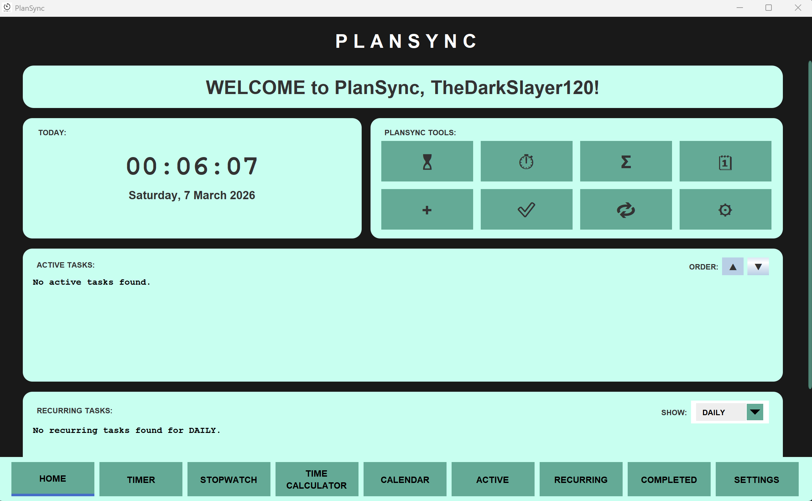
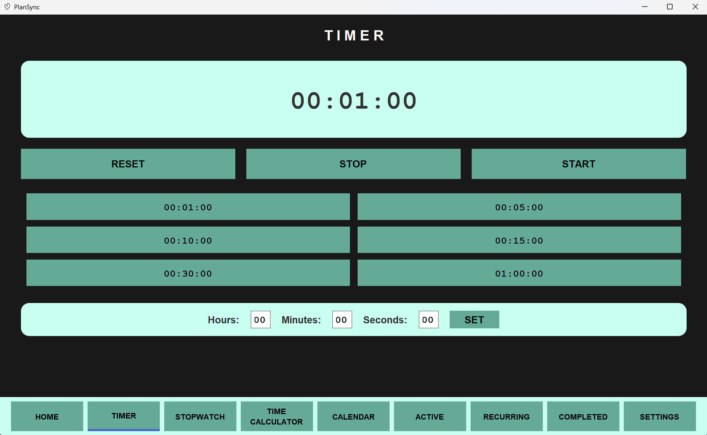
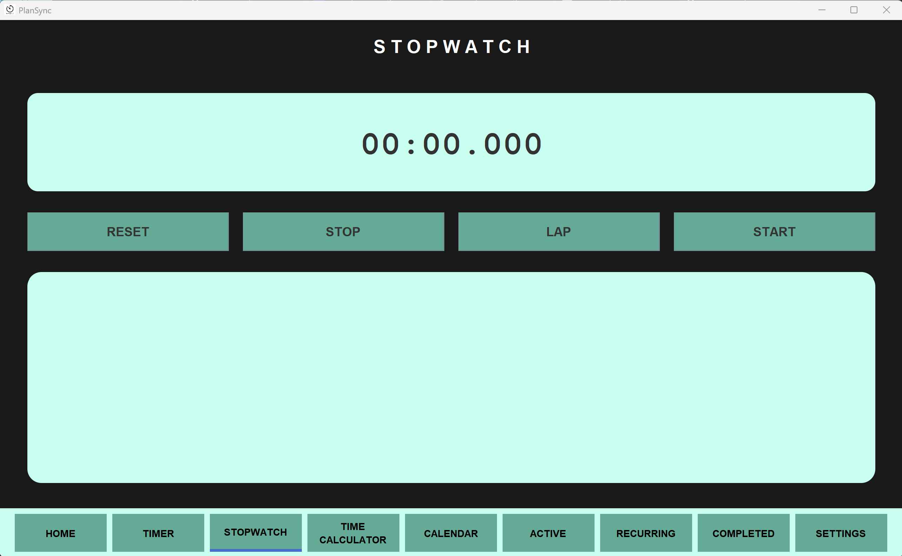
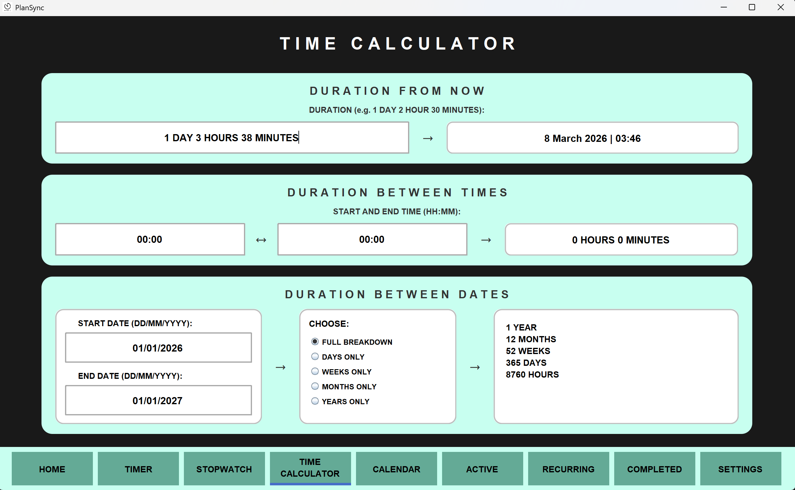
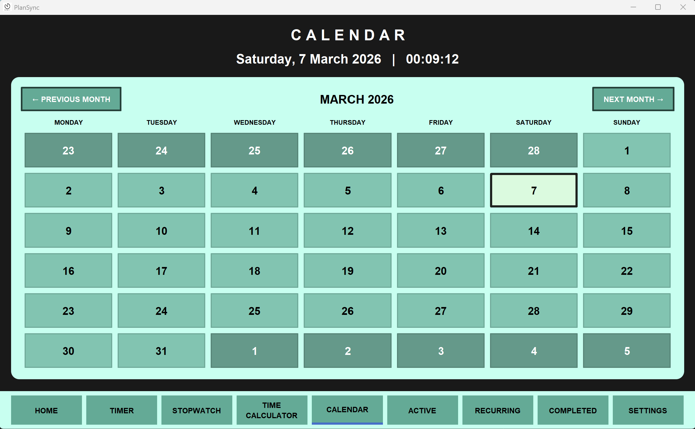
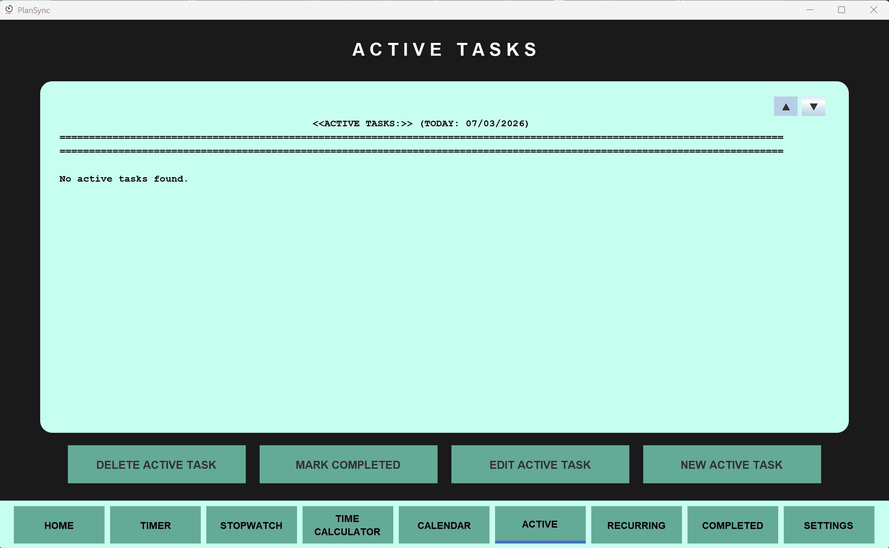
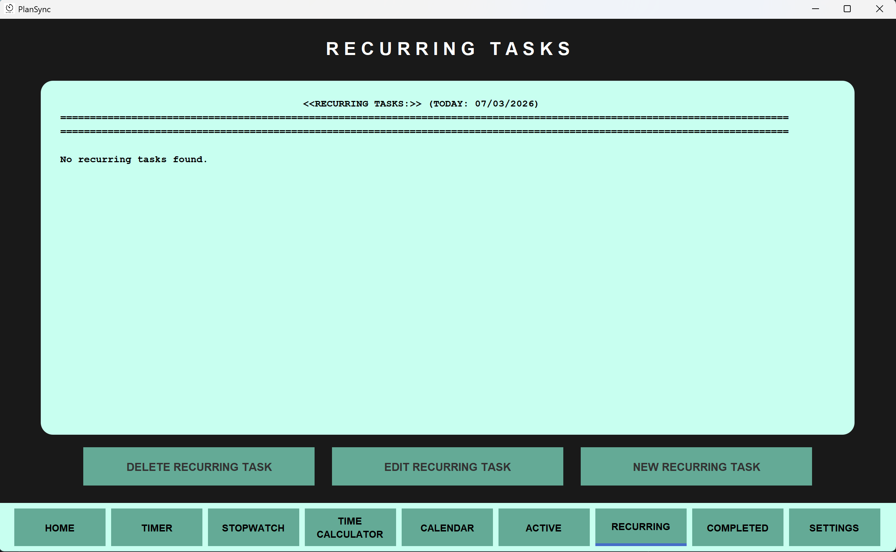
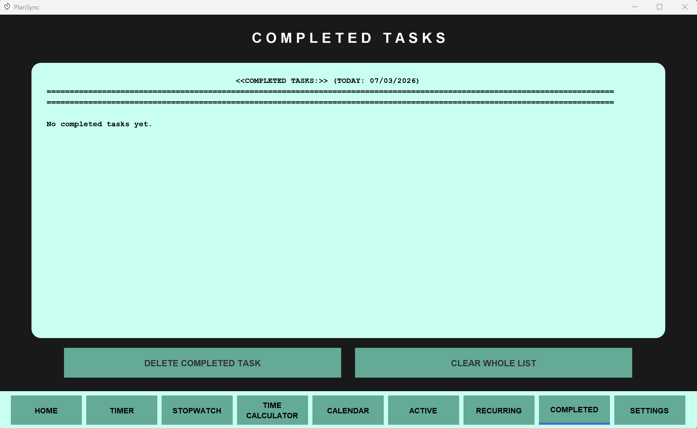
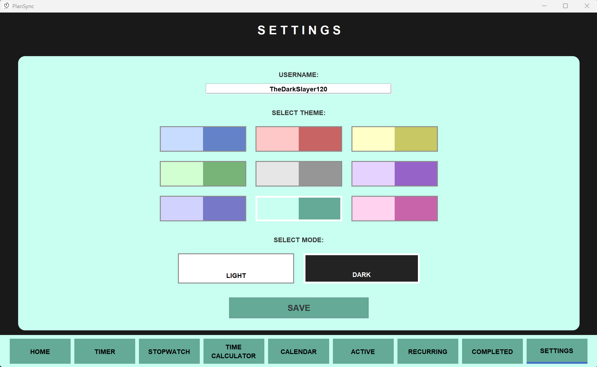

# PlanSync

PlanSync is a **Time Management and Task Scheduling Application** designed to help users manage workload more fluently and efficiently while keeping track of progress.

Built in **Java**, PlanSync provides a desktop-based interface for organising tasks, tracking deadlines, managing recurring schedules, and using built-in productivity tools such as a **timer**, **stopwatch**, **calendar**, and **time calculator**.

<p align="left">
  
</p>

---

## Overview

PlanSync was developed as a personal productivity application focused on combining **task management** with **time-planning utilities** in one place.

The application allows users to:

- manage active tasks with deadlines
- keep track of completed tasks
- schedule recurring tasks
- view deadlines visually in a calendar
- calculate time and date differences
- use a built-in countdown timer and stopwatch
- personalise the application with themes, dark mode, and username settings

---

## Download and Run

Prebuilt releases are available on the [Releases](../../releases) page.

Download the version for your operating system:

- **Windows:** `PLANSYNC-Win.zip`
- **macOS:** `PLANSYNC-Mac.zip`
- **Linux:** `PLANSYNC-Linux.zip`

After downloading, **extract the ZIP file first**, then follow the steps for your platform.

---

### Windows

The Windows release includes a bundled Java runtime, so you do **not** need to install Java separately.

#### Steps

1. Download `PLANSYNC-Win.zip` from the **Releases** page
2. Right-click the ZIP file and select **Extract All**
3. Open the extracted folder:
   `PLANSYNC-Win/PlanSync/`
4. Double-click **`PlanSync.exe`**

#### If Microsoft Defender / SmartScreen shows a warning

Because the app is distributed as a downloadable `.exe`, Windows may show a warning such as **"Windows protected your PC"**.

To open the app:

1. Click **More info**
2. Click **Run anyway**

If Windows still blocks the file, try this:

1. Right-click **`PlanSync.exe`**
2. Select **Properties**
3. If you see an **Unblock** option, tick it
4. Click **Apply**
5. Click **OK**
6. Open **`PlanSync.exe`** again

You can also do the same on the downloaded ZIP file before extracting it:

1. Right-click `PLANSYNC-Win.zip`
2. Select **Properties**
3. Tick **Unblock** if the option appears
4. Click **Apply**
5. Extract the ZIP again

> Only do this if you downloaded the file from this repository’s official **Releases** page and trust the source.

---

### macOS

The macOS release requires **Java 17 or newer**.

#### Steps

1. Download `PLANSYNC-Mac.zip`
2. Extract the ZIP
3. Open the extracted folder:
   `PLANSYNC-Mac/PlanSync/`
4. Double-click **`run.command`**

You can also launch it from Terminal:

```bash
chmod +x run.command
./run.command
```

Or run the JAR directly:

```bash
java -jar PlanSync.jar
```

#### If macOS blocks the script the first time

If macOS prevents `run.command` from opening:

- Right-click **`run.command`** and choose **Open**
- Then confirm that you want to run it

---

### Linux

The Linux release requires **Java 17 or newer**.

#### Steps

1. Download `PLANSYNC-Linux.zip`
2. Extract the ZIP
3. Open a terminal in:
   `PLANSYNC-Linux/PlanSync/`
4. Run:

```bash
chmod +x run.sh
./run.sh
```

You can also run the JAR directly:

```bash
java -jar PlanSync.jar
```

---

## Local Data Storage

PlanSync stores its data locally in the **`data/`** folder next to the application files.

This includes:

- active tasks
- completed tasks
- recurring tasks
- user settings

No external database is required.

---

## Features

### Task Management

- Add active tasks with:
  - task name
  - task description
  - deadline date
- Edit existing active tasks
- Delete active tasks
- Mark active tasks as completed
- View how many days remain until a deadline
- See overdue task status automatically

### Completed Task Tracking

- Move finished tasks into a completed tasks section
- Store both:
  - original deadline
  - completion date
- View completed task history
- Delete selected completed tasks
- Clear all completed tasks

### Recurring Task Scheduling

- Add recurring tasks with:
  - name
  - description
  - frequency settings
- Supported recurring frequencies:
  - Daily
  - Weekly
  - Monthly
  - Yearly
- Edit recurring tasks
- Delete recurring tasks
- Display next-occurrence style status information for recurring tasks

### Calendar Integration

- Monthly calendar view
- Monday-first calendar layout
- Highlights dates with active tasks
- Shows task counts per day
- Lets users inspect deadlines visually
- Supports month-to-month navigation

### Productivity Tools

#### Countdown Timer
- set custom durations
- start
- stop
- pause and resume
- reset timer
- completion alert sound

#### Stopwatch
- start
- stop
- reset
- lap recording
- live elapsed time updates

#### Time Calculator
- add a duration from the current time
- calculate duration between two times
- calculate duration between two dates
- display results in:
  - full breakdown
  - days
  - weeks
  - months
  - years

### Home Dashboard

- Welcome screen with personalised username
- Live clock and current date display
- Quick-access tool shortcuts
- Active task overview
- Sort active tasks by deadline order
- Filter recurring tasks by frequency

### Personalisation and Settings

- Custom username
- Theme selection
- Light mode / dark mode
- Settings saved locally using a properties file

### Data Persistence

- Task and settings data saved locally using text and properties files
- Stores:
  - active tasks
  - completed tasks
  - recurring tasks
  - user settings

---

## Screenshots

### Home Dashboard


### Timer


### Stopwatch


### Time Calculator


### Calendar


### Active Tasks


### Recurring Tasks


### Completed Tasks


### Settings


---

## Tech Stack

- **Language:** Java
- **GUI Framework:** Java Swing / AWT
- **Architecture Style:** MVC-style separation using controllers, models, and views
- **Storage:** Local file-based persistence (`.txt` and `.properties` files)

---

## Project Structure

```text
PlanSync/
│
├── Main.java
├── controller/
├── model/
├── views/
├── components/
├── modelTerminal/
├── data/
├── screenshots/
├── icons/
└── README.md
```

---

## Notes

- The **Windows release** includes its own Java runtime.
- The **macOS** and **Linux** releases require **Java 17 or newer**.
- App data is stored locally in the `data/` folder inside the extracted release.
- On first launch, security prompts may appear depending on your operating system. This is common for unsigned desktop app downloads.

---

## License

This project is for personal and educational use unless stated otherwise by the repository owner.
